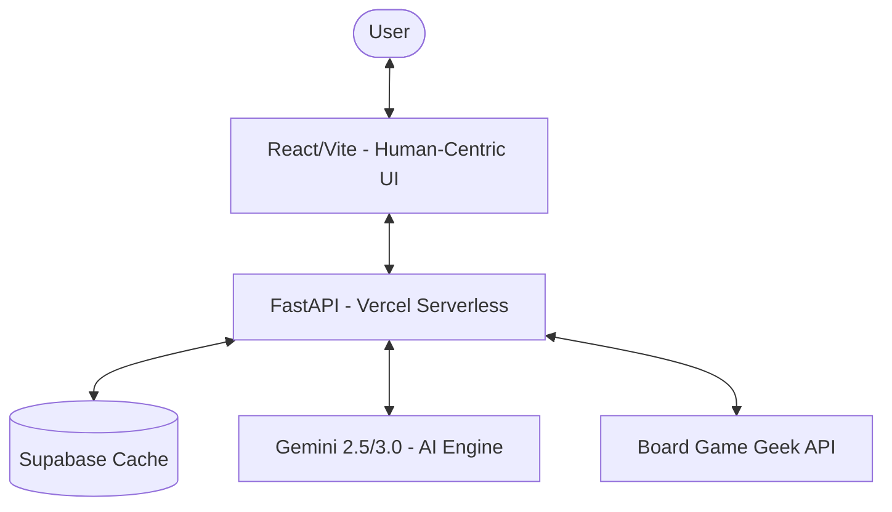

# RuleScribe Games

<div align="center">
  

  ### **The Infinite Intelligence for Board Gamers**
  **「世界中のボードゲームのルールを、瞬時に、正確に、その手に」。**

  [](https://rule-scribe-games.vercel.app)
  [](https://opensource.org/licenses/MIT)
  [](https://www.python.org/)
  [](https://reactjs.org/)
</div>

---

## ⚡ Zero-Fat Architecture

本プロジェクトは、**「不純物ゼロ」**の設計思想に基づき、圧倒的な開発スピードとメンテナンス性を実現しています。

- **Rapid Boot**: `uv` による 0.1秒での環境同期。`requirements.txt` の管理コストを排除。
- **Single Command Orchestration**: すべての操作（Setup, Dev, Lint, Deploy, AI Skill）は `Taskfile` に集約。
- **Zero-Fat Code**: `Ruff` による厳格なコード品質管理。冗長なコメントやエラーハンドリングを廃し、成功パスのロジックを鮮明化。
- **Human-Centric Design**: デジタル庁 x Serendie の設計指針を継承した、美しく直感的な「Borderless」な体験。

## 👑 Why RuleScribe? — The Paradigm Shift

既存のボードゲームデータベース（BoardGameGeek, Bodogamer）が抱える「言語の壁」「検索の揺らぎ」「情報の非構造化」を、AIの力で完全に解決します。

| Feature | 🇺🇸 BoardGameGeek (BGG) | 🇯🇵 Bodogamer | ⚡ **RuleScribe Games** |
| :--- | :--- | :--- | :--- |
| **Language** | 英語 (English) | 日本語 (Manual) | **日本語 (AI Instant Translation)** |
| **Speed** | 検索に時間がかかる | 投稿待ち | **全ゲーム即時生成 (Real-time)** |
| **Structure** | フォーラム・PDF (非構造) | レビュー (非構造) | **完全構造化 (準備/プレイ/終了)** |
| **Coverage** | 世界最大だが散乱 | 国内流通が中心 | **BGG全量 × AI構造化** |

**「探す」時代は終わりました。これからは「AIに聞く」時代です。**

## 🚀 主要機能

- **Gemini 3.0 Flash Preview Powered**: 最新のAIモデルによる高精度な日本語要約。
- **Structural Rule Synthesis**: 「準備」「ゲームプレイ」「終了条件」を自動解析し、構造化。
- **Intelligence Caching**: Supabase (PostgreSQL) を活用した、思考の永続化と高速レスポンス。
- **SEO Optimized**: ボードゲーム検索での上位表示を狙う、セマンティックなマークアップ。

## 🏗️ アーキテクチャ



## 🛠️ クイックスタート

```bash
# 1. 環境構築 (Backend sync & Frontend install)
task setup

# 2. 開発開始 (Hot-reload for both layers)
task dev

# 3. 品質担保 (Zero-Fat Cleanup & Lint)
task lint
```

## 🤖 AI Automation (Claude Skills)

AIエージェントが自律的に実行可能な、4つの高度な自動化ワークフロー。

1. **`add-game`**: 新規ボードゲームの追加（画像生成、DB登録、ドキュメント化を一括）。
2. **`deploy`**: リリースの自動検証とデプロイの同期。
3. **`fix-data`**: DBコンテンツの自動修正とフォーマット正規化。
4. **`search-verify`**: 外部ソースとの一貫性チェック。
5. **`fetch-docs`**: Context7 を使用した最新ドキュメントの取得。

## 📂 リポジトリ構成

- **[`app/`](./app/README.md)**: 基幹ロジック。AI連携、検索、キャッシュ制御。
- **[`frontend/`](./frontend/README.md)**: 人間中心のUI設計。CSS Variablesを活用した透過的デザイン。
- **[`scripts/`](./scripts/README.md)**: 運用を支える自動化の源泉。
- **[`docs/`](./docs/README.md)**: [`SEO.md`](./docs/SEO.md), [`CONTENT_GUIDELINES.md`](./docs/CONTENT_GUIDELINES.md) 等の戦略ドキュメント。

---

**Built with Precision by RuleScribe Games Team**
MIT © 2026 RuleScribe Games contributors
