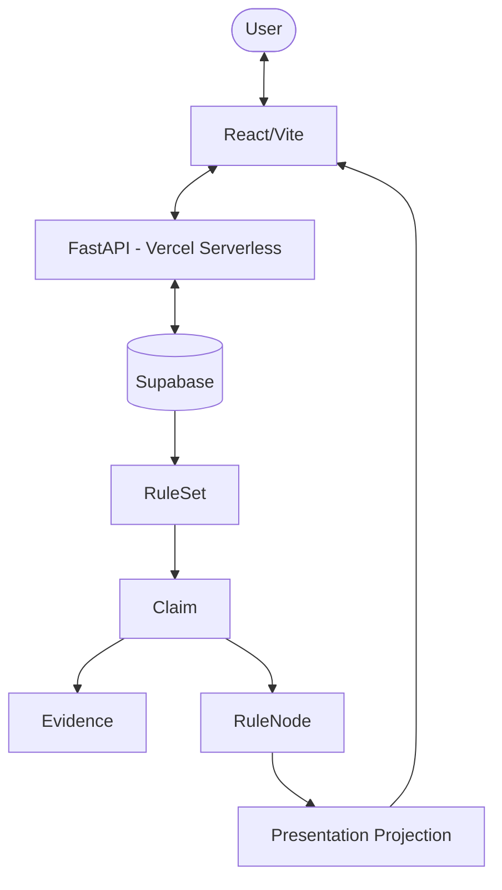

# RuleScribe Games

[](https://github.com/KAFKA2306/rule-scribe-games/actions/workflows/deploy.yml)
[](https://github.com/KAFKA2306/rule-scribe-games/actions/workflows/rule-quality.yml)
[](https://github.com/KAFKA2306/rule-scribe-games/actions/workflows/curated-game-release-verification.yml)

<div align="center">
  

  ### **The Infinite Intelligence for Board Gamers**
  **「世界中のボードゲームのルールを、瞬時に、正確に、その手に」。**

  [](https://rule-scribe-games.vercel.app)
  [](https://opensource.org/licenses/MIT)
  [](https://www.python.org/)
  [](https://reactjs.org/)
</div>

---

## Zero-Fat Architecture

本プロジェクトは、ゲーム固有の事実を複数の手書き経路へ複製せず、source-backed canonical dataから必要なviewを導出します。

- **Canonical identity**: work / title alias / edition / platform / languageを分離する。
- **Source-bound rules**: RuleSet → Claim → Evidence → RuleNodeを正準のrule authorityとする。
- **Derived presentation**: GamePageは選択RuleSetのaccepted evidence-backed projectionだけを表示する。旧ゲーム行のrule textへfallbackしない。
- **One ingestion path**: curated gameは `data/curated-games/<slug>.json` と既存validation/release workflowから追加・更新する。
- **Merge ≠ release**: PRの品質判定とproduction release/read-backを別workflow・別状態として扱う。

## 主要機能

- 日本語/英語title aliasを含むcanonical search・filter・sort・pagination
- source-bound RuleSetと版差の明示
- accepted claim + supporting evidenceに限定したルールpresentation
- canonical glossary / concept / rule graph / component catalog
- game単位URL、server-side rendering、structured metadata

## Architecture


```mermaid
graph TD
    User([User]) <--> Frontend[React/Vite]
    Frontend <--> API[FastAPI - Vercel Serverless]
    API <--> Catalog[(Supabase)]
    Catalog --> RuleSet[RuleSet]
    RuleSet --> Claim[Claim]
    Claim --> Evidence[Evidence]
    Claim --> RuleNode[RuleNode]
    RuleNode --> Projection[Presentation Projection]
    Projection --> Frontend
```

## Quick start

```bash
task setup
task dev
task lint
```

Curated gameの追加・更新:

```bash
task game:add GAME=<slug>
```

このcommandはPR準備用のvalidation/read-only preflightであり、productionへ直接writeしません。production publicationはmerge後のrelease workflowが担当します。

## Repository

- `backend/app/`: FastAPI、canonical read/write、RuleSet/evidence/projection service
- `api/`: Vercel Serverless entrypoint
- `frontend/`: React/Vite UI
- `data/curated-games/`: source-backed curated game input
- `docs/`: canonical specification and operations

## Issue workflow

新規Issueは、Acceptance Criteria・tests・必要なproduction verificationまでを完遂可能な契約として扱います。運用規約は `docs/ISSUE_GUIDE.md` を参照してください。

---

MIT © 2026 RuleScribe Games contributors
