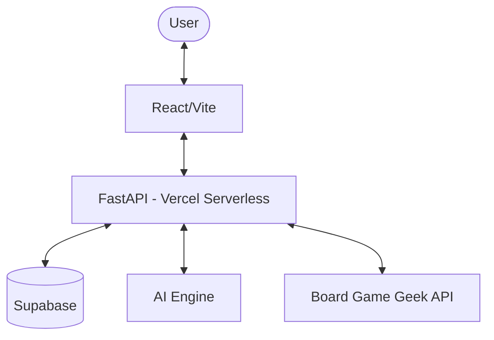

# RuleScribe Games

<div align="center">
  

  ### **The Infinite Intelligence for Board Gamers**
  **「世界中のボードゲームのルールを、瞬時に、正確に、その手に」。**

  [](https://rule-scribe-games.vercel.app)
  [](https://opensource.org/licenses/MIT)
  [](https://www.python.org/)
  [](https://reactjs.org/)
</div>

---

## ⚡ Zero-Fat Architecture

本プロジェクトは、**「不純物ゼロ」**の設計思想に基づき、開発速度とメンテナンス性を高める構成を採用しています。

- **Rapid Boot**: `uv` によるPython依存関係の高速同期。
- **Single Command Orchestration**: Setup、Dev、Lintなどの主要操作を `Taskfile` に集約。
- **Zero-Fat Code**: `Ruff` を中心にコード品質を機械検証し、不要な重複を増やさない。
- **Human-Centric Design**: 情報探索ではなく「すぐ遊べる理解」に到達することをUIの中心に置く。

## 👑 Why RuleScribe? — The Paradigm Shift

既存のボードゲームデータベースで起こりやすい「言語の壁」「検索の揺らぎ」「情報の非構造化」に対し、検索・構造化・ルール理解を一つの体験へまとめます。

| Feature | 🇺🇸 BoardGameGeek (BGG) | 🇯🇵 国内ルール情報 | ⚡ **RuleScribe Games** |
| :--- | :--- | :--- | :--- |
| **Language** | 英語中心 | 日本語中心 | **日本語で構造化** |
| **Discovery** | データベース検索 | 個別記事・説明書検索 | **検索からルール理解まで連続** |
| **Structure** | PDF・フォーラム・DB | 記事・説明書 | **準備 / プレイ / 終了条件を構造化** |
| **Goal** | 情報を探す | 説明を読む | **遊ぶために必要な理解へ早く到達** |

## 🚀 主要機能

- **AI-assisted Rule Synthesis**: サーバー側で設定したAIモデルを利用し、日本語のルール理解を支援。
- **Structural Rule Synthesis**: 「準備」「ゲームプレイ」「終了条件」を解析し、構造化。
- **Intelligence Caching**: Supabase (PostgreSQL) を利用した正準データの永続化と高速レスポンス。
- **SEO-oriented Delivery**: ゲーム単位のURLとセマンティックなマークアップを提供。

## 🏗️ アーキテクチャ


```mermaid
graph TD
    User([User]) <--> Frontend[React/Vite]
    Frontend <--> API[FastAPI - Vercel Serverless]
    API <--> Cache[(Supabase)]
    API <--> AI[AI Engine]
    API <--> BGG[Board Game Geek API]
```

## 🛠️ クイックスタート

```bash
# 1. 環境構築 (Backend sync & Frontend install)
task setup

# 2. 開発開始 (Hot-reload for both layers)
task dev

# 3. 品質確認
task lint
```

## 🤖 AI Automation (Claude Skills)

AIエージェント向けの自動化ワークフローを `.claude/skills/` に配置しています。実際に利用可能なskillと手順は、各 `SKILL.md` を正準として参照してください。

## 📂 リポジトリ構成

- **[`backend/app/`](./backend/app/README.md)**: FastAPI基幹ロジック、検索、AI連携、データアクセス。
- **[`api/`](./api/)**: Vercel Serverlessのエントリーポイント。
- **[`frontend/`](./frontend/README.md)**: React/Viteによるユーザーインターフェース。
- **[`backend/scripts/`](./backend/scripts/README.md)**: backend運用・データ処理用スクリプト。
- **[`docs/`](./docs/README.md)**: 正準仕様・設計・運用ドキュメント。

## 🧭 Issue workflow

新規Issueは、実装だけでなくAcceptance Criteria・Tests・必要なproduction verification・cleanup/rollbackまで完遂できる契約として作成します。Feature、AI/Data Quality、Ops/BugのIssue Formsと運用規約は **[`docs/ISSUE_GUIDE.md`](./docs/ISSUE_GUIDE.md)** を参照してください。

---

**Built with Precision by RuleScribe Games Team**
MIT © 2026 RuleScribe Games contributors
