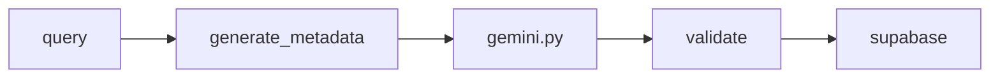

# Services

LLMによるボードゲーム情報の自動生成。

## モジュール

```
app/services/
└── game_service.py  # LLM生成 + CRUD
```

## フロー



## API

| 関数 | 説明 |
|------|------|
| `generate_metadata(query, context?)` | LLMでゲーム情報生成 |
| `GameService.search_games(query)` | DB検索 |
| `GameService.get_game_by_slug(slug)` | ゲーム取得 |
| `GameService.create_game_from_query(query)` | 新規作成 |
| `GameService.update_game_content(slug)` | 再生成 |
