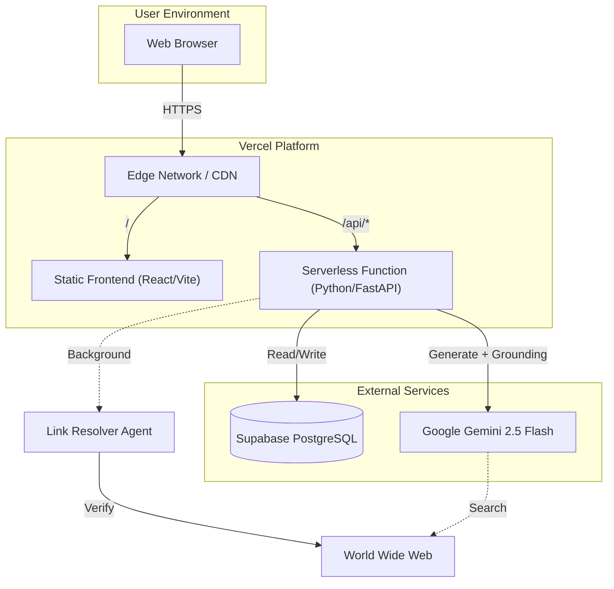
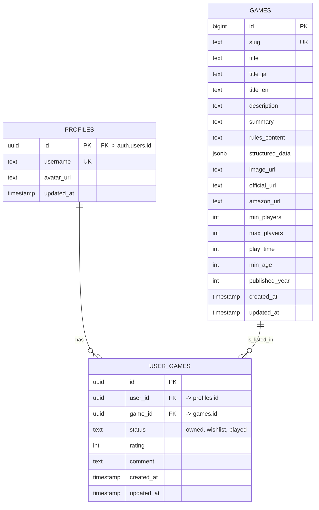
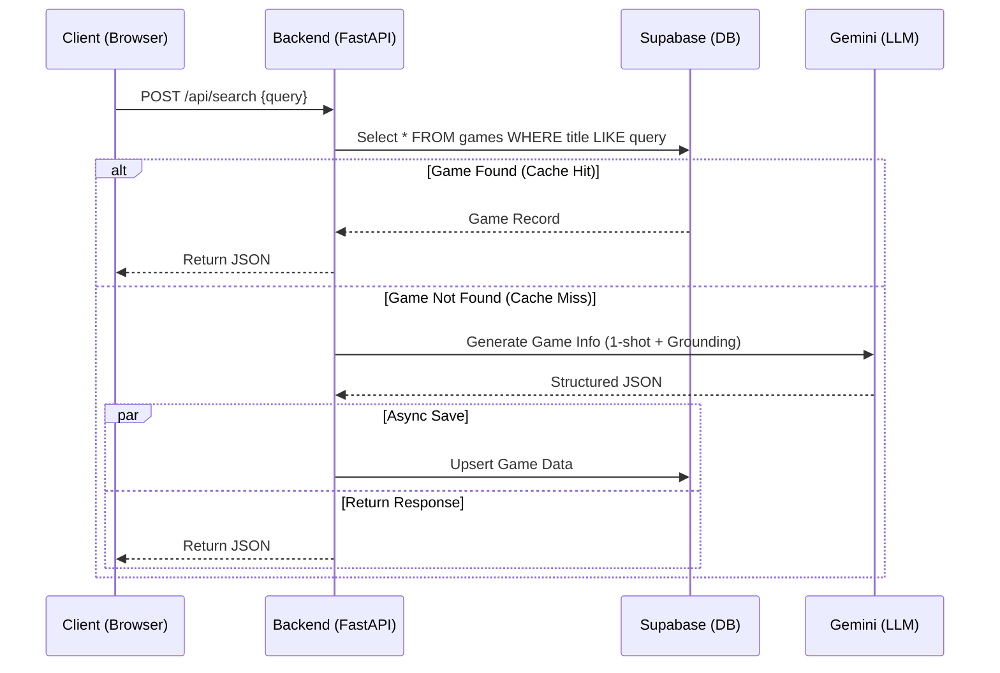

# ボドゲのミカタ (Bodoge no Mikata) - 完全統合マスターガイド

> **重要な免責事項**: このドキュメントは、プロジェクトの**唯一の真実（Single Source of Truth）**です。コードや設定に関する疑問が生じた場合、まずここを参照してください。このファイルは、プロジェクトの「戦略」「ロジック」「設定」「スキーマ」「ユーザー体験」「コーディングスタイル」「デプロイ」のすべてを網羅しています。

---

## 1. プロジェクト憲章 (Project Charter)

### 1.1 サービス名
*   **日本語**: ボドゲのミカタ
*   **英語 (Repo)**: Bodoge no Mikata
*   **略称**: Bodoge no Mikata

### 1.2 システムコンセプト定義 (System Concept Definition)

1.  **Living Wiki (生きているWiki)**
    *   静的なデータベースではありません。ユーザーが「知らないゲーム」を検索した瞬間、AIが世界中から情報を収集し、Wikiページをリアルタイムで生成します。
    *   **自己進化 (Regeneration)**: 情報が古い、または間違っている場合、ユーザーは「再生成」ボタンを押すことができます。システムは現在の情報をコンテキストとして読み込み、AIが自ら訂正を行います（Self-Correction）。

2.  **Minimal Code & High Speed (最小コード・最高速度)**
    *   **"No Boilerplate"**: 不要なレイヤー（複雑なORMラッパー、過剰な抽象化）を排除します。
    *   **Direct & Raw**: Supabaseへのアクセスはシンプルに保ち、AIのプロンプトも直感的です。

3.  **Modern & Cool UI (モダンでクールなUI)**
    *   **Neon Accents**: `Zen Maru Gothic` (丸ゴシック) と `Space Grotesk` を組み合わせ、未来的かつ親しみやすい印象。
    *   **User Centric**: 専門用語を避け、「セットアップ」「勝ち方」など、初心者が知りたい情報にフォーカスします。

### 1.3 ターゲットユーザー
*   **インスト時間を短縮したいゲーマー**: 説明書を読むのが苦手、または時間がない人。
*   **輸入ゲーム愛好家**: 英語やドイツ語のルールブックしか手元になく、日本語の要約が欲しい人。
*   **プレイ中の確認**: 「このカードの効果なんだっけ？」を瞬時に解決したいプレイヤー。

---

## 2. 開発方針とアーキテクチャパターン (Development Policy & Architecture Pattern)

本プロジェクトは、**「本番の堅牢性」**と**「実験の自由度」**を両立させるために、明確な二層構造を採用します。

### 2.1 方針 (Policy)
> **本番 (Core) は最小・安定構成に固定。**
> **実験 (Experiments) は完全に横に分離。**

### 2.2 🏛 上層：CORE (本番 OS)
*信頼できる一本線*

*   **Endpoint**: `/api/search`, `/api/games`
*   **Logic**: Supabase 検索 OR (Gemini 1-shot 生成 -> Upsert)
*   **GeminiClient**: 1-shot JSON 専用。Google Search Grounding有効。プロンプトは `prompts.yaml` で一元管理。
*   **DataEnhancer**: `GameService`内に統合（Link Resolver Agent）。
*   **Frontend**: `/api/*` のみを叩く。
*   **特徴**: 壊れない、明瞭、保守しやすい。
*   **Logging**: `app/core/logger.py` による中央集権ログ管理。

### 2.3 🧪 下層：EXPERIMENTS (実験レイヤー)
*自由に壊していい場所*

*   **Location**: `backend/experiments/`
*   **Files**: `crew_agentic_demo.py` など
*   **Access**: Supabase を直接叩く (API 経由ではない)
*   **Execution**: ローカル (`uv run python experiments/xxx.py`)
*   **昇格ルール**: 「何度も使うほど便利」と確信できた機能のみ、慎重に API 化して Core に統合。

---

## 3. システム構成 (System Configuration)

### 3.1 システム構成図 (System Configuration Diagram)


### 3.2 ファイル構成 (Detailed File Manifest)
*   `backend/init_db.sql`: データベーススキーマとトリガー定義。
*   `backend/app/main.py`: バックエンドのエントリーポイント。
*   `backend/app/core/settings.py`: 環境変数読み込み。
*   `backend/app/core/logger.py`: **[NEW]** ログ設定 (Rotation + Console)。
*   `backend/app/core/gemini.py`: Gemini API クライアント (Google Grounding)。
*   `backend/app/prompts/prompts.yaml`: AIプロンプト定義ファイル。
*   `backend/app/services/game_service.py`: ゲーム検索・生成・更新・リンク解決のコアロジック。
*   `backend/app/routers/games.py`: ゲーム検索・一覧・詳細・更新エンドポイント。
*   `backend/app/models.py`: 共有Pydanticモデル定義。
*   `backend/experiments/`: 実験用コード置き場 (CrewAIなど)。
*   `scripts/`: 開発・保守用スクリプト。
    *   `verify_regeneration.py`: ゲーム再生成ロジックの動作検証用。
*   `frontend/src/index.css`: グローバルスタイルとカラー変数定義。
*   `vercel.json`: デプロイ設定とルーティングルール。
*   `frontend/vite.config.js`: フロントエンドのビルド・開発プロキシ設定。

---

### 3.3 詳細設計図 (Detailed Design Diagrams)

#### 3.3.1 E-R図 (Entity-Relationship Diagram)


#### 3.3.2 検索・生成シーケンス (Search & Generation Sequence)


---

## 4. データモデリング (Data Modeling)

**Platform**: Supabase (PostgreSQL)

### 4.1 テーブル定義 (`games`)
`backend/init_db.sql` に基づく現在の定義です。

```sql
-- pgvector拡張 (将来的なベクトル検索用)
create extension if not exists vector;

create table if not exists games (
  id uuid primary key default gen_random_uuid(), -- UUID
  slug text unique,                 -- URL用スラッグ
  title text not null,              -- ゲームタイトル (日/英)
  description text,                 -- 短い概要
  summary text,                     -- AI生成要約
  rules_content text,               -- 詳細ルール (Markdown)
  rules jsonb default '{}'::jsonb,  -- 構造化ルール (Legacy)
  source_url text,                  -- 情報源URL
  image_url text,                   -- 画像URL
  structured_data jsonb,            -- 構造化データ
  
  -- Analytics & Logic
  view_count bigint default 0,      -- 閲覧数
  search_count bigint default 0,    -- 検索ヒット数
  data_version integer default 0,   -- データ拡張バージョン
  is_official boolean default false,-- 公式/検証済みフラグ

  -- Metadata
  min_players integer,
  max_players integer,
  play_time integer,
  min_age integer,
  published_year integer,

  -- Titles
  title_ja text,
  title_en text,

  -- External Links
  official_url text,
  bgg_url text,
  bga_url text,
  amazon_url text,

  -- Media
  audio_url text,

  created_at timestamp with time zone default now() not null,
  updated_at timestamp with time zone default now() not null
);

create index if not exists idx_games_slug on games(slug);
create index if not exists idx_games_title on games(title);
```

### 4.2 トリガー (Triggers)
`extensions.moddatetime` を使用して信頼性の高い更新日時管理を行います。

---

## 5. 設定値・環境変数 (Settings & Configurations)

### 5.1 環境変数 (`app/core/settings.py`)
システムが依存する全ての環境変数です。

| 変数名 | デフォルト値 | 説明 |
| :--- | :--- | :--- |
| `GEMINI_API_KEY` | `None` (Required) | Google AI Studio APIキー。 |
| `GEMINI_MODEL` | `models/gemini-3-flash-preview` | 使用するAIモデル名。 |
| `SUPABASE_URL` | `None` (Required) | Supabase プロジェクトURL。 |
| `SUPABASE_SERVICE_ROLE_KEY` | `None` (Recommended for Backend) | RLSをバイパスする管理者キー。バックエンド操作に推奨。 |
| `SUPABASE_KEY` / `VITE_...` | `None` (Fallback) | `SERVICE_ROLE_KEY` がない場合、`SUPABASE_KEY` -> `NEXT_PUBLIC_...` -> `VITE_SUPABASE_ANON_KEY` の順でフォールバックします。 |
| `AMAZON_TRACKING_ID` | `None` | AmazonアソシエイトのトラッキングID。 |

### 5.2 定数値 (Hardcoded Constants)
*   `gemini.py`: タイムアウト `60.0` 秒。
*   `search.py`: "Simple Search" 判定の文字数制限 `50` 文字。
*   `game_service.py`: クールダウン `30` 日, 検証タイムアウト `30.0` 秒。

---

## 6. AIプロンプト全集 (Prompt Registry)

すべてのプロンプトは `backend/app/prompts/prompts.yaml` で管理されます。

### 6.1 新規検索・生成 (`metadata_generator`)
ユーザーが新しいゲームを検索した際、または再生成時に実行されます。
*   **Google Grounding**: 有効化されており、ハルシネーションを最小限に抑えます。
*   **Regeneration**: 既存データをコンテキストとして受け取り、空白を埋め、誤りを訂正します。

### 6.2 リンク解決 (`link_resolve`)
`Link Resolver Agent` がバックグラウンドで実行し、公式URL、Amazon URL、画像URLの候補を探して検証します。

---

## 7. API仕様書 (API Specification)

すべてのAPIは `FastAPI` によって提供され、`/api` プレフィックスを持ちます。

### 7.1 POST `/api/search`
検索と生成のメインエンドポイント。

**Request**:
```json
{
  "query": "カタン"
}
```

**Response (SearchResult)**:
```json
{
  "id": "a0eebc99...",
  "slug": "catan",
  "title": "Catan (カタン)",
  "description": "...",
  "rules_content": "...",
  "structured_data": { ... }
}
```

### 7.2 GET `/api/games`
最近更新されたゲームの一覧を取得します。

### 7.3 GET `/api/games/{slug}`
特定のゲーム詳細を取得。Slug または ID でアクセス可能。
**バックグラウンド処理**: `Link Resolver` が起動し、リンク情報の検証と更新を非同期で試みます。

---

## 8. フロントエンド詳細 (Frontend Details)

**Framework**: React 18 + Vite
**Styling**: CSS Modules (Variables) + Utility Classes

### 8.1 デザインシステム (Design System)
`frontend/src/index.css` で定義されている現在のCSS変数です。

```css
:root {
  --bg-dark: #0b1221;
  --bg-card: rgba(255, 255, 255, 0.05);
  --accent: #4ef0c7;
  --text-main: #eef2ff;
  --font-main: 'Zen Maru Gothic', sans-serif;
  --font-head: 'Space Grotesk', sans-serif;
}
```

---

## 9. 開発環境とデプロイフロー (Development Environment & Deploy Flow)

### 9.1 ローカル開発環境の構築

**依存関係 (Dependencies)**:
*   **Backend**: `fastapi`, `google-generativeai`, `supabase`, `httpx`, `PyYAML`
*   **Frontend**: `react`, `react-markdown`

**コマンド (Taskfile)**:
*   `task dev`: 開発サーバー起動 (Backend + Frontend)
*   `task lint`: Lint & Format

### 9.2 開発者用スクリプト (Developer Scripts)
*   **検証スクリプト**: `scripts/verify_regeneration.py`
    *   **用途**: Gemini APIを使用したゲーム再生成フローをローカルでテストします。
    *   **実行**: `uv run python scripts/verify_regeneration.py`
    *   **注意**: 実際に Gemni API コストが発生します。

### 9.3 実験的機能の開発 (Experiments)
CrewAIなどの新しいAIエージェントを試す場合は、必ず `backend/experiments/` ディレクトリ内で開発してください。
`backend/app/` 内のコードは本番用であり、実験的な依存関係を含めてはいけません。

### 9.3 コーディング規約 (Coding Standards)
*   **KISS**: シンプルに保つ。
*   **No Comments**: コードで語る。
*   **Japanese Content**: ユーザー向けテキストは日本語。
*   **Type Hints**: Pythonコードには型ヒントを必須とする。
*   **Prompts in YAML**: プロンプトは `prompts.yaml` に記述する。

---

## 10. 障害管理 (Failure Management)

### 10.1 Vercel環境変数
`echo -n` を使用して改行を含めずに設定すること。

### 10.2 IDの型定義
SupabaseのIDは **UUID (str)** です。`int` として扱わないこと。

### 10.3 Supabase Upsert
必ずホワイトリスト方式でカラムをフィルタリングしてから `upsert` すること。AIが生成した余分なフィールドが含まれているとエラーになります。

### 10.4 トラブルシューティング (Troubleshooting)
*   **Backend 起動エラー**  
    * `ImportError` / `ModuleNotFoundError` → `uv sync` を再実行。Python 3.11 系で起動しているか確認。  
    * `.env` 未読込で `PLACEHOLDER` が設定されていると Supabase/Gemini 初期化が失敗する。
*   **環境変数不足/誤り**  
    * Gemini 401/404 → `GEMINI_API_KEY` 不在かタイプミス。  
    * Supabase 401/403 → `SUPABASE_SERVICE_ROLE_KEY` / `SUPABASE_KEY` / `NEXT_PUBLIC_SUPABASE_URL` が欠落。  
    * Frontend が空リスト → `NEXT_PUBLIC_SUPABASE_*` が未設定でクライアント生成が `null`。
*   **Rate Limits (429)**  
    * Gemini 429 はログに残るだけで DB 更新は行われない。数分待って再試行するか、キーを追加してローテーション（例: `GEMINI_API_KEY_2` など）を実装する。  
    * 連続して `generate=true` を叩かない。まず Supabase キャッシュを検索し、生成はミスヒット時のみに抑える。  
    * 再発する場合は同時実行数を絞る（キューイング）、プロンプト長を抑える、バッチ化を避ける。  
*   **重複レコード / 上書きされない**  
    * `slug` は `title` 由来のため、タイトルの表記揺れで upsert 衝突が起きる。確定キーがある場合は `source_url` を渡す。  
    * `PATCH /api/games/{slug}?regenerate=true&fill_missing_only=true` で欠損のみ補完、`false` で全面上書き。背景タスクなので即時反映しない点に注意。  
*   **ポート衝突**  
    * 8000 / 5173 が埋まっている → `task kill` で解放。  
*   **Vercel 502/タイムアウト**  
    * 環境変数未設定またはコールドスタートが原因。Vercel に `.env` 内容を反映し、再デプロイ。  
*   **CORS / フロント通信失敗**  
    * CORS は許可済みだが、開発プロキシ設定が無いと相対パスで別ポートに届かないことがある。フロントからは `/api/...` の相対パスで叩くか、`vite.config` の `proxy` を有効にする。  
*   **フロントが白画面になる**  
    * `npm install` 未実施、または `task dev` でフロントを起動していない。  
    * ブラウザコンソールに JS エラーが出ていないか確認（型の無いフィールドや undefined 参照が多い）。  
    * API を絶対URLで別ポートに向けると CORS で落ちることがある。開発時は相対 `/api/...` を推奨。  
    * 環境変数を変えたら Vite を再起動（`import.meta.env` はビルド時に埋め込まれる）。  
*   **Supabase スキーマ不一致**  
    * 新規カラム追加やインデックス不足で API が 500/422 を返すことがある。`backend/init_db.sql` を Supabase SQL エディタで再実行して整合させる。  
    * 既存データへの影響がある変更（NOT NULL 追加など）はバックアップを取得してから適用。  
    * RLS/ポリシーを有効化している場合、サービスロールキーを使う操作と anon での挙動が異なるので両方確認する。  
    * スキーマ変更時の手順例:  
        1. Supabase で DB バックアップを取得。  
        2. ローカルで `backend/init_db.sql` を更新し、SQL エディタで実行。  
        3. `app/models.py` など Pydantic モデルとフロント型（必要なら）を同期。  
        4. 生成ロジックが依存するフィールドなら Gemini プロンプトの出力スキーマも更新（`app/prompts/prompts.yaml`）。  
        5. `task lint` と簡易 API テスト（`GET /api/games`, `POST /api/search`）で回帰を確認。  

---

## 11 検証済みリンク (Verified Links)

*   **Logic**: `Link Resolver Agent` (`resolve_external_links`) がLLMを使って候補URLを生成し、Pythonコード (`httpx`) でステータスコード 200 を確認してからDBに保存します。
*   **優先順位**: 常にこの検証済み `amazon_url` が優先して使用されます。
*   **自動化**: ゲーム生成時および更新時にバックグラウンドで自動実行されます。


---

## 12. SEOと検証 (SEO & Validation)

### 12.1 Google Search Console Verification
*   **Method**: HTML File Upload
*   **File**: `frontend/public/google0e9954154a369dd5.html`
*   **Content**: `google-site-verification: google0e9954154a369dd5.html`
*   **Purpose**: Google Search Console の所有権確認用。

### 12.2 Meta Tags & Indexability
*   **Robots Meta Tag**: `frontend/index.html` に `<meta name="robots" content="index, follow" />` を配置し、インデックスを許可。
*   **Dynamic Meta Tags**: `react-helmet-async` を使用して、各ゲームページ (`GamePage.jsx`) で動的に `<title>`, `<meta name="description">`, OGPタグを生成。
*   **Canonical URL**: 重複コンテンツ防止のため、正規化URLを設定。

### 12.3 Sitemap & Robots.txt
*   **Sitemap**: `frontend/public/sitemap.xml` (手動/静的配置)
*   **Robots.txt**: `frontend/public/robots.txt`

---

## 13. 新機能詳細 (New Features Specification)

### 13.1 音声解説機能 (Audio Explanation)
*   **目的**: 視覚だけでなく聴覚でもルールを理解できるようにする（アクセシビリティ向上）。
*   **技術**: Browser Native `SpeechSynthesis` API (Web Speech API)。
    *   **Backend不要**: サーバー負荷ゼロ、コストゼロ。
    *   **Offline対応**: ブラウザの機能に依存するため、一部オフラインでも動作可能。
*   **実装**: `frontend/src/pages/GamePage.jsx` 内の `TextToSpeech` コンポーネント。
*   **挙動**:
    *   「🔊」ボタンで `game.summary` (要約) を読み上げ開始。
    *   「⏹️」ボタンで停止。
    *   日本語音声 (`ja-JP`) を自動選択。

### 13.2 ユーザー管理 & リスト機能 (User Management)
*   **目的**: ユーザーが「持っているゲーム」「欲しいゲーム」を管理できるようにする。
*   **認証**: Supabase Auth (Email, Google予定)。
*   **データベーススキーマ**:
    *   `profiles`: ユーザー基本情報。`auth.users` と1対1で同期（Trigger使用）。
    *   `user_games`: ユーザーとゲームの多対多関係。
        *   `status`: 'owned' (所持), 'wishlist' (欲しい), 'played' (プレイ済み)。
        *   `rating`: 1-10の評価。
        *   `comment`: 個別メモ。
*   **セキュリティ**: RLS (Row Level Security) により、他人のデータは閲覧のみ許可、更新は本人のみ。

### 13.3 ソーシャルシェア (Social Sharing)
*   **Twitter (X)**:
    *   カスタムインテントURLを使用: `https://twitter.com/intent/tweet`
    *   テキスト: `ボードゲーム「{title}」がアツい！今すぐチェック！`
    *   ハッシュタグ: `#ボドゲのミカタ`
*   **Copy Link**: クリップボードAPIを使用。非対応ブラウザ用のフォールバック実装あり。

---

## 14. プロンプトエンジニアリング戦略 (Prompt Engineering)

### 14.1 構造化データの進化
初期の `popular_cards` (カードゲーム限定) から、より汎用的な `key_elements` へ移行しました。

*   **Key Elements**:
    *   **Type**: Card, Tile, Board, Token, Power Plant, Meeple など。
    *   **Reason**: 単なる機能説明ではなく、「なぜそれが面白いのか（Charm）」を含めるようAIに指示。

### 14.2 Markdownルールの強制
`rules_content` は単なるテキストではなく、以下のヘッダー構造を持つMarkdownとして生成されます。
1.  `## Setup` (準備)
2.  `## Gameplay` (ゲームの流れ)
3.  `## End Game` (終了条件・勝利条件)

これにより、フロントエンドでの可読性が向上し、将来的にはセクションごとのアコーディオン表示なども可能になります。

---

## 15. デプロイメント戦略 (Deployment Strategy)

### 15.1 Vercel Configuration
*   **Framework Preset**: Vite (Frontend), Python (Backend).
*   **Configuration File**: `vercel.json`
    *   **Rewrites**: `/api/*` へのリクエストを `backend/app/main.py` へルーティング。
    *   **SPA Fallback**: その他のリクエストは `frontend/index.html` へ。

### 15.2 Environment Variables (Production)
本番環境 (Vercel) では、以下の変数を設定する必要があります。
*   `GEMINI_API_KEY`: 本番用のGoogle AI Studioキー。
*   `SUPABASE_URL`: 本番SupabaseプロジェクトURL。
*   `SUPABASE_KEY`: `service_role` キーではなく、**`anon` キー**を使用することを推奨（RLSで保護されているため）。ただし、Backend処理で特権が必要な場合は `service_role` を検討するが、現在は `anon` で十分。
*   `AMAZON_TRACKING_ID`: 本番用のアソシエイトID。

### 15.3 CI/CD Flow
1.  **GitHub Push**: `main` ブランチへのプッシュをトリガー。
2.  **Vercel Build**:
    *   Frontend: `npm install && npm run build`
    *   Backend: `pip install -r requirements.txt`
3.  **Deploy**: 自動的にEdge Networkへデプロイ。

---

## 16. 将来のロードマップ (Future Roadmap)

### 16.1 フェーズ 2: ユーザーエンゲージメント (Current)
*   **Google Login (Issue #61)**: ワンクリックでログイン。
*   **Like / Favorite (Issue #62)**: 個別のゲームに「いいね」をつける機能。
*   **Lists (Issue #59, #60)**:
    *   「持っている (Owned)」
    *   「遊びたい (Wishlist)」
    *   「遊んだ (Played)」
    *   これらをマイページで管理・公開。

### 16.2 フェーズ 3: ソーシャル & コミュニティ
*   **Review & Rating**: 星評価とテキストレビュー。
*   **Follow User**: 他のユーザーをフォローし、アクティビティ（「〇〇を買った！」）をタイムラインで表示。
*   **Share Lists**: 「私のベスト10」リストを作成してSNSでシェア。

### 16.3 フェーズ 4: 高度なAI機能
*   **Rule Q&A Chatbot**: 「このカード、手札が0枚のとき使える？」といった具体的な質問に答えるチャットボット。
*   **Recommendation**: 「カタンが好きなら、次はこれがおすすめ」というAIレコメンド。

---

## 17. サービスマネジメント (Service Management)

### 17.1 API Rate Limits (Gemini)
*   **現状**: Gemini 2.5 Flash Free Tier を使用。
*   **制限**: 1分あたり15リクエスト (RPM)、1日あたり1,500リクエスト (RPD)。
*   **対策**:
    *   **Caching**: `Cache-Control` ヘッダーにより、CDNとブラウザでキャッシュを最大化。
    *   **Database First**: 必ずSupabaseを先に検索し、存在しない場合のみ生成。
    *   **Availability**: 429エラーが発生した場合、バックエンドは `logs/app.log` にエラーを記録し、ユーザーへのレスポンスは維持します（再生性が失敗するのみ）。

### 17.2 ログ監視
*   **Backend Logs**: `backend/logs/app.log` にログが出力されます（ローカル開発時）。
*   **Vercel Logs**: Vercel DashboardのFunction Logsで確認可能。
*   **Critical Errors**: 500エラー発生時は直ちにログを確認。

### 17.3 データベースバックアップ
*   **Backup Strategy**: SupabaseのPITR (Point-in-Time Recovery) 機能に依存。
*   **Manual**: スキーマ変更前には、手動でSQLダンプを取得することを推奨。

---

## 18. User Stories

### Core User Needs (Phase 1)
- **As a board gamer who dislikes reading long manuals**, I want to see a summarized confirmation of the rules, so that I can start playing immediately.
- **As an imported board game enthusiast**, I want to get a Japanese summary of English rules, so that I can play games that don't have a Japanese version.
- **As a player in the middle of a game**, I want to quickly check specific rules or card effects, so that the game flow isn't interrupted.

### User Engagement (Phase 2: Current)
- **As a frequent user**, I want to log in with my Google account, so that I can save my preferences and game lists.
- **As a collector**, I want to mark games as "Owned", "Wishlist", or "Played", so that I can manage my collection and share it with friends.
- **As a user**, I want to "Like" specific game pages, so that I can easily access them later.

### Community & Social (Phase 3: Future)
- **As a community member**, I want to rate and review games, so that I can share my opinions and help others choose games.
- **As a social user**, I want to follow other users, so that I can see what games they are buying or playing.
- **As an influencer**, I want to create and share "Best 10" lists, so that I can recommend games to my followers.

### Advanced AI features (Phase 4: Future)
- **As a curious player**, I want to ask the AI specific questions about rules (e.g., "Can I use this card when I have 0 cards?"), so that I can resolve edge cases without searching through the entire rulebook.
- **As a user looking for new games**, I want personalized recommendations based on games I like (e.g., "If you like Catan, try this"), so that I can discover new favorites.

---

## 19. Troubleshooting Guide

Vercel デプロイと本番環境のデバッグ手順。

### 目次

1. [本番環境で「Loading」のまま / 白い画面](#1-本番環境でloadingのまま--白い画面)
2. [静的アセットが HTML として配信される](#2-静的アセットが-html-として配信される)
3. [API エンドポイントが 500 エラー](#3-api-エンドポイントが-500-エラー)
4. [環境変数の確認方法](#4-環境変数の確認方法)
5. [デバッグ手順チェックリスト](#5-デバッグ手順チェックリスト)

### 19.1 本番環境で「Loading」のまま / 白い画面

#### 症状

- トップページにアクセスすると背景色のみ表示
- `#root` div が空
- ゲーム一覧が表示されない

#### 原因と解決策

##### 19.1.1 Supabase 環境変数の未設定

**原因**: `NEXT_PUBLIC_SUPABASE_URL` / `NEXT_PUBLIC_SUPABASE_ANON_KEY` が Vercel で未設定の場合、`createClient(undefined, undefined)` がクラッシュし、React アプリ全体が起動しない。

**確認方法**:
```bash
# ブラウザ DevTools Console で確認
# エラーがない場合でも #root が空なら環境変数を疑う
```

**解決策**:
1. Vercel Dashboard → Project → Settings → Environment Variables
2. 以下を **Production** 環境に追加:
   - `NEXT_PUBLIC_SUPABASE_URL`
   - `NEXT_PUBLIC_SUPABASE_ANON_KEY`
3. **Redeploy** (キャッシュなし)

##### 19.1.2 JavaScript ランタイムエラー

**確認方法**:
```javascript
// DevTools Console で確認
// 赤いエラーメッセージを探す
```

**よくあるエラー**:
| エラー | 原因 | 解決策 |
|-------|------|-------|
| `Cannot read properties of null` | 初期化前のオブジェクト参照 | null チェック追加 |
| `Uncaught TypeError` | 型の不一致 | API レスポンス形式を確認 |

### 19.2 静的アセットが HTML として配信される

#### 症状

- Console に `Failed to load module script: Expected a JavaScript module script but the server responded with a MIME type of "text/html"` が表示される
- `/assets/index-XXX.js` にアクセスすると HTML が返る

#### 原因

`vercel.json` の rewrite 設定で、静的アセットまで `/index.html` に書き換えられている。

**問題のある設定**:
```json
{
  "rewrites": [
    { "source": "/:path*", "destination": "/index.html" }
  ]
}
```

#### 解決策

**正しい `vercel.json`**:
```json
{
  "buildCommand": "cd frontend && npm install && npm run build",
  "outputDirectory": "frontend/dist",
  "rewrites": [
    {
      "source": "/api/:path*",
      "destination": "/api/index.py"
    }
  ]
}
```

SPA フォールバックは **書かない**。Vercel は `outputDirectory` 内の静的ファイルを自動的に配信する。

### 19.3 API エンドポイントが 500 エラー

#### 症状

- `/api/games` が 500 Internal Server Error を返す
- `FUNCTION_INVOCATION_FAILED` が Vercel ログに出る

#### 確認手順

```bash
# ブラウザで直接確認
https://bodoge-no-mikata.vercel.app/api/games
```

#### よくある原因

| 原因 | 確認方法 | 解決策 |
|------|---------|-------|
| 環境変数未設定 | Vercel Dashboard で確認 | `GEMINI_API_KEY`, `SUPABASE_SERVICE_ROLE_KEY` を設定 |
| Python import エラー | Vercel Function Logs を確認 | `api/index.py` のパスを修正 |
| 依存パッケージ不足 | `requirements.txt` を確認 | 必要なパッケージを追加 |

### 19.4 環境変数の確認方法

#### ローカル

```bash
# .env ファイルの存在確認
cat .env

# Vite で使う環境変数 (VITE_ または NEXT_ プレフィックス)
cat frontend/.env
```

#### Vercel

1. Dashboard → Project → Settings → Environment Variables
2. **Production / Preview / Development** 環境ごとに設定を確認
3. 変更後は **必ず Redeploy**

#### 必要な環境変数一覧

| 変数名 | 用途 | 必須 |
|-------|------|------|
| `GEMINI_API_KEY` | バックエンド LLM 呼び出し | ✅ |
| `SUPABASE_SERVICE_ROLE_KEY` | バックエンド DB 操作 | ✅ |
| `NEXT_PUBLIC_SUPABASE_URL` | フロントエンド Supabase 接続 | ✅ |
| `NEXT_PUBLIC_SUPABASE_ANON_KEY` | フロントエンド Supabase 認証 | ✅ |

### 19.5 デバッグ手順チェックリスト

本番環境で問題が発生した場合の切り分け手順:

#### Step 1: アセット配信の確認

```
□ https://bodoge-no-mikata.vercel.app/ にアクセス
□ DevTools → Network → index-XXX.js の Response Headers を確認
□ Content-Type が application/javascript であること
```

**NG の場合**: `vercel.json` の rewrite を修正

#### Step 2: API の確認

```
□ https://bodoge-no-mikata.vercel.app/api/games にアクセス
□ JSON が返ってくること
□ ステータスコードが 200 であること
```

**NG の場合**: バックエンド環境変数と Python コードを確認

#### Step 3: フロントエンド初期化の確認

```
□ DevTools → Console でエラーを確認
□ DevTools → Elements → #root の中身を確認
□ #root が空なら JavaScript 初期化でクラッシュしている
```

**NG の場合**: Supabase 環境変数とフロントエンドコードを確認

#### Step 4: キャッシュクリア

```
□ Vercel Dashboard → Deployments → Redeploy (キャッシュなし)
□ ブラウザで Ctrl+Shift+R (ハードリロード)
```

---

### 参考: 過去に発生した問題と解決策

#### 2024-12-06: React アプリが起動しない

**症状**: `#root` が空、白い画面

**原因**: `createClient(undefined, undefined)` でクラッシュ

**解決策**:
```javascript
// frontend/src/lib/supabase.js
export const supabase = supabaseUrl && supabaseAnonKey
  ? createClient(supabaseUrl, supabaseAnonKey)
  : null
```

#### 2024-12-06: 静的アセットが HTML として配信

**症状**: `Failed to load module script: MIME type of "text/html"`

**原因**: `vercel.json` の SPA fallback rewrite

**解決策**: `/:path*` → `/index.html` の rewrite を削除
