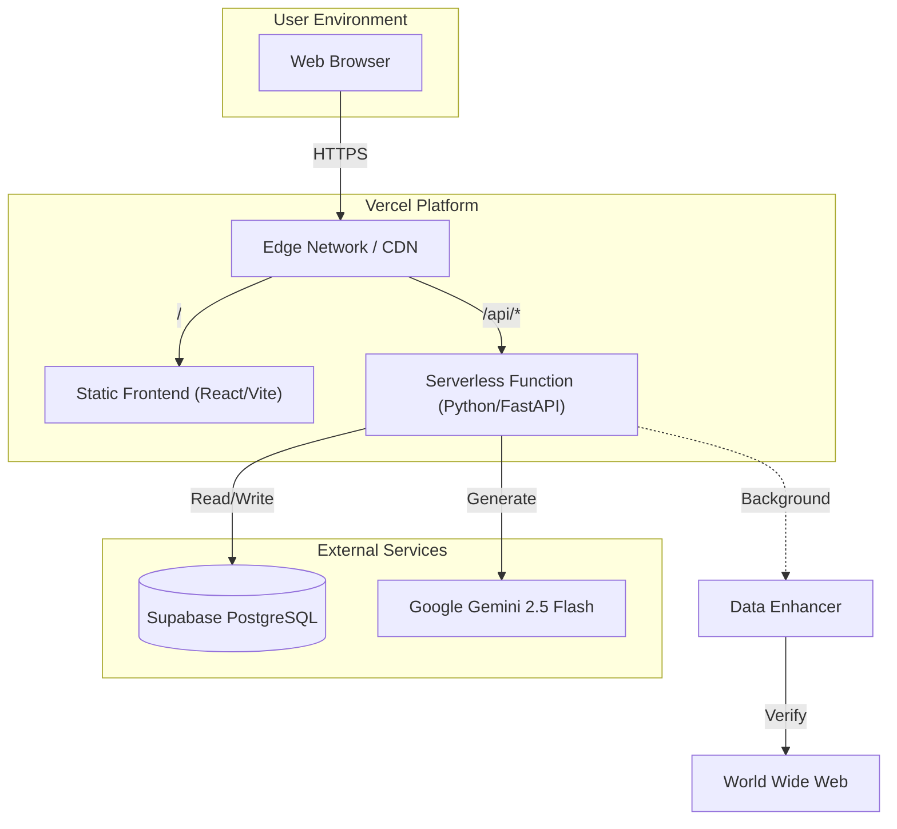
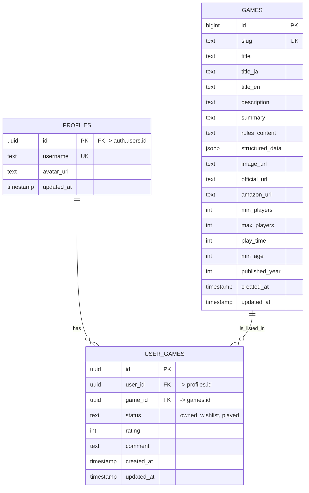
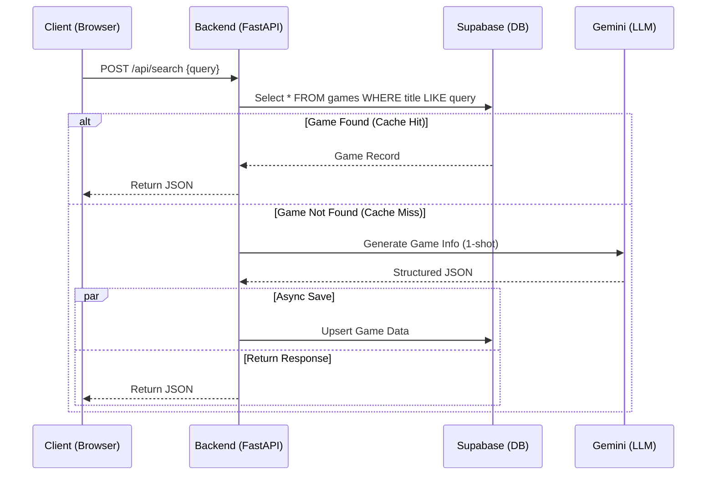

# ボドゲのミカタ (Bodoge no Mikata) - 完全統合マスターガイド

> **重要な免責事項**: このドキュメントは、プロジェクトの**唯一の真実（Single Source of Truth）**です。コードや設定に関する疑問が生じた場合、まずここを参照してください。このファイルは、プロジェクトの「戦略」「ロジック」「設定」「スキーマ」「ユーザー体験」「コーディングスタイル」「デプロイ」のすべてを網羅しています。

---

## 1. プロジェクト憲章 (Project Charter)

### 1.1 サービス名
*   **日本語**: ボドゲのミカタ
*   **英語 (Repo)**: Bodoge no Mikata
*   **略称**: Bodoge no Mikata

### 1.2 システムコンセプト定義 (System Concept Definition)

1.  **Living Wiki (生きているWiki)**
    *   静的なデータベースではありません。ユーザーが「知らないゲーム」を検索した瞬間、AIが世界中から情報を収集し、Wikiページをリアルタイムで生成します。
    *   **自己進化**: 検索されるたびにデータベースが成長し、次回以降のユーザーはその恩恵（高速表示）を受けます。

2.  **Minimal Code & High Speed (最小コード・最高速度)**
    *   **"No Boilerplate"**: 不要なレイヤー（複雑なORMラッパー、過剰な抽象化）を排除します。
    *   **Direct & Raw**: Supabaseへのアクセスはシンプルに保ち、AIのプロンプトも直感的です。

3.  **Modern & Cool UI (モダンでクールなUI)**
    *   **Neon Accents**: `Zen Maru Gothic` (丸ゴシック) と `Space Grotesk` を組み合わせ、未来的かつ親しみやすい印象。
    *   **User Centric**: 専門用語を避け、「セットアップ」「勝ち方」など、初心者が知りたい情報にフォーカスします。

### 1.3 ターゲットユーザー
*   **インスト時間を短縮したいゲーマー**: 説明書を読むのが苦手、または時間がない人。
*   **輸入ゲーム愛好家**: 英語やドイツ語のルールブックしか手元になく、日本語の要約が欲しい人。
*   **プレイ中の確認**: 「このカードの効果なんだっけ？」を瞬時に解決したいプレイヤー。

---

## 2. 開発方針とアーキテクチャパターン (Development Policy & Architecture Pattern)

本プロジェクトは、**「本番の堅牢性」**と**「実験の自由度」**を両立させるために、明確な二層構造を採用します。

### 2.1 方針 (Policy)
> **本番 (Core) は最小・安定構成に固定。**
> **実験 (Experiments) は完全に横に分離。**

### 2.2 🏛 上層：CORE (本番 OS)
*信頼できる一本線*

*   **Endpoint**: `/api/search`, `/api/games`
*   **Logic**: Supabase 検索 OR (Gemini 1-shot 生成 -> Upsert)
*   **GeminiClient**: 1-shot JSON 専用。CrewAI 禁止。プロンプトは `prompts.yaml` で一元管理。
*   **DataEnhancer**: バックグラウンドタスクとしてリンク検証・更新を実行。
*   **Frontend**: `/api/*` のみを叩く。
*   **特徴**: 壊れない、明瞭、保守しやすい。

### 2.3 🧪 下層：EXPERIMENTS (実験レイヤー)
*自由に壊していい場所*

*   **Location**: `backend/experiments/`
*   **Files**: `crew_agentic_demo.py` など
*   **Access**: Supabase を直接叩く (API 経由ではない)
*   **Execution**: ローカル (`uv run python experiments/xxx.py`)
*   **昇格ルール**: 「何度も使うほど便利」と確信できた機能のみ、慎重に API 化して Core に統合。

---

## 3. システム構成 (System Configuration)

### 3.1 システム構成図 (System Configuration Diagram)


### 3.2 ファイル構成 (Detailed File Manifest)
*   `backend/init_db.sql`: データベーススキーマとトリガー定義。
*   `backend/app/main.py`: バックエンドのエントリーポイント。
*   `backend/app/core/settings.py`: 環境変数読み込み。
*   `backend/app/core/prompts.py`: `prompts_data.py` ローダー。
*   `backend/app/core/prompts_data.py`: 全AIプロンプト定義 (Python Dictionary)。
*   `backend/app/services/gemini_client.py`: 検索と基本情報抽出のAIロジック (1-shot)。Amazonリンク注入含む。
*   `backend/app/services/data_enhancer.py`: リンク検証・自動更新ロジック (Background Task)。
*   `backend/app/routers/games.py`: ゲーム一覧・詳細取得エンドポイント (DataEnhancer統合済み)。
*   `backend/app/routers/search.py`: 検索・生成エンドポイント。
*   `backend/app/services/amazon_affiliate.py`: Amazon検索URL生成ロジック。
*   `backend/app/models.py`: 共有Pydanticモデル定義。
*   `backend/experiments/`: 実験用コード置き場 (CrewAIなど)。
*   `frontend/src/index.css`: グローバルスタイルとカラー変数定義。
*   `vercel.json`: デプロイ設定とルーティングルール。
*   `frontend/vite.config.js`: フロントエンドのビルド・開発プロキシ設定。

---

### 3.3 詳細設計図 (Detailed Design Diagrams)

#### 3.3.1 E-R図 (Entity-Relationship Diagram)

> **凡例**:
> *   **PK (Primary Key)**: 主キー。データを一意に識別するためのID。
> *   **UK (Unique Key)**: ユニークキー。重複を許さない項目（URLスラッグなど）。
> *   **FK (Foreign Key)**: 外部キー。他のテーブルとの関連。

#### 3.3.2 検索・生成シーケンス (Search & Generation Sequence)


---

## 4. データモデリング (Data Modeling)

**Platform**: Supabase (PostgreSQL)

### 4.1 テーブル定義 (`games`)
`backend/init_db.sql` に基づく現在の定義です。

```sql
-- pgvector拡張 (将来的なベクトル検索用)
create extension if not exists vector;

create table if not exists games (
  id uuid primary key default gen_random_uuid(), -- UUID
  slug text unique,                 -- URL用スラッグ
  title text not null,              -- ゲームタイトル (日/英)
  description text,                 -- 短い概要
  summary text,                     -- AI生成要約
  rules_content text,               -- 詳細ルール (Markdown)
  rules jsonb default '{}'::jsonb,  -- 構造化ルール (Legacy)
  source_url text,                  -- 情報源URL
  image_url text,                   -- 画像URL
  structured_data jsonb,            -- 構造化データ
  
  -- Analytics & Logic
  view_count bigint default 0,      -- 閲覧数
  search_count bigint default 0,    -- 検索ヒット数
  data_version integer default 0,   -- データ拡張バージョン
  is_official boolean default false,-- 公式/検証済みフラグ

  -- Metadata
  min_players integer,
  max_players integer,
  play_time integer,
  min_age integer,
  published_year integer,

  -- Titles
  title_ja text,
  title_en text,

  -- External Links
  official_url text,
  bgg_url text,
  bga_url text,
  amazon_url text,

  -- Media
  audio_url text,

  created_at timestamp with time zone default now() not null,
  updated_at timestamp with time zone default now() not null
);

create index if not exists idx_games_slug on games(slug);
create index if not exists idx_games_title on games(title);
```

### 4.2 トリガー (Triggers)
`extensions.moddatetime` を使用して信頼性の高い更新日時管理を行います。

---

## 5. 設定値・環境変数 (Settings & Configurations)

### 5.1 環境変数 (`backend/app/core/settings.py`)
システムが依存する全ての環境変数です。

| 変数名 | デフォルト値 | 説明 |
| :--- | :--- | :--- |
| `GEMINI_API_KEY` | `None` (Required) | Google AI Studio APIキー。 |
| `GEMINI_MODEL` | `models/gemini-2.5-flash` | 使用するAIモデル名。 |
| `SUPABASE_URL` | `None` (Required) | Supabase プロジェクトURL。 |
| `SUPABASE_URL` | `None` (Required) | Supabase プロジェクトURL。 |
| `SUPABASE_SERVICE_ROLE_KEY` | `None` (Recommended for Backend) | RLSをバイパスする管理者キー。バックエンド操作に推奨。 |
| `SUPABASE_KEY` / `VITE_...` | `None` (Fallback) | `SERVICE_ROLE_KEY` がない場合、`SUPABASE_KEY` -> `NEXT_PUBLIC_...` -> `VITE_SUPABASE_ANON_KEY` の順でフォールバックします。 |
| `AMAZON_TRACKING_ID` | `None` | AmazonアソシエイトのトラッキングID。 |

### 5.2 定数値 (Hardcoded Constants)
*   `gemini_client.py`: タイムアウト `60.0` 秒。
*   `search.py`: "Simple Search" 判定の文字数制限 `50` 文字。
*   `data_enhancer.py`: クールダウン `30` 日, 検証タイムアウト `30.0` 秒。

---

## 6. AIプロンプト全集 (Prompt Registry)

すべてのプロンプトは `backend/app/core/prompts_data.py` で管理されます。

### 6.1 新規検索・基本情報抽出 (`gemini_client.extract_game_info`)
ユーザーが新しいゲームを検索した際に実行されます。厳密な事実に基づき、ハルシネーションを回避するよう指示されています。

### 6.2 リンク検証・更新 (`data_enhancer.find_valid_links`)
`DataEnhancer` がバックグラウンドで実行する際、公式URL、Amazon URL、画像URLの候補を探すために使用されます。

---

## 7. API仕様書 (API Specification)

すべてのAPIは `FastAPI` によって提供され、`/api` プレフィックスを持ちます。

### 7.1 POST `/api/search`
検索と生成のメインエンドポイント。

**Request**:
```json
{
  "query": "カタン"
}
```

**Response (SearchResult)**:
```json
{
  "id": "a0eebc99...",
  "slug": "catan",
  "title": "Catan (カタン)",
  "description": "...",
  "rules_content": "...",
  "structured_data": { ... }
}
```

### 7.2 GET `/api/games`
最近更新されたゲームの一覧を取得します。

### 7.3 GET `/api/games/{slug}`
特定のゲーム詳細を取得。Slug または ID でアクセス可能。
**バックグラウンド処理**: `DataEnhancer` が起動し、リンク情報の検証と更新を非同期で試みます。

---

## 8. フロントエンド詳細 (Frontend Details)

**Framework**: React 18 + Vite
**Styling**: CSS Modules (Variables) + Utility Classes

### 8.1 デザインシステム (Design System)
`frontend/src/index.css` で定義されている現在のCSS変数です。

```css
:root {
  --bg-dark: #0b1221;
  --bg-card: rgba(255, 255, 255, 0.05);
  --accent: #4ef0c7;
  --text-main: #eef2ff;
  --font-main: 'Zen Maru Gothic', sans-serif;
  --font-head: 'Space Grotesk', sans-serif;
}
```

---

## 9. 開発環境とデプロイフロー (Development Environment & Deploy Flow)

### 9.1 ローカル開発環境の構築

**依存関係 (Dependencies)**:
*   **Backend**: `fastapi`, `google-generativeai`, `supabase`, `httpx`, `PyYAML`
*   **Frontend**: `react`, `react-markdown`

**コマンド (Taskfile)**:
*   `task dev`: 開発サーバー起動 (Backend + Frontend)
*   `task lint`: Lint & Format

### 9.2 実験的機能の開発 (Experiments)
CrewAIなどの新しいAIエージェントを試す場合は、必ず `backend/experiments/` ディレクトリ内で開発してください。
`backend/app/` 内のコードは本番用であり、実験的な依存関係を含めてはいけません。

### 9.3 コーディング規約 (Coding Standards)
*   **KISS**: シンプルに保つ。
*   **No Comments**: コードで語る。
*   **Japanese Content**: ユーザー向けテキストは日本語。
*   **Type Hints**: Pythonコードには型ヒントを必須とする。
*   **Prompts in Python**: プロンプトは `prompts_data.py` に記述する (Vercel互換性のため)。

---

## 10. 障害管理 (Failure Management)

### 10.1 Vercel環境変数
`echo -n` を使用して改行を含めずに設定すること。

### 10.2 IDの型定義
SupabaseのIDは **UUID (str)** です。`int` として扱わないこと。

### 10.3 Supabase Upsert
必ずホワイトリスト方式でカラムをフィルタリングしてから `upsert` すること。AIが生成した余分なフィールドが含まれているとエラーになります。

### 10.4 トラブルシューティング (Troubleshooting)
*   **Backend Startup Failure**:
    *   `ImportError` や `ModuleNotFoundError` が発生する場合、依存関係 (`uv sync`) の不整合や、実験的コード (`crewai_tools` 等) の誤ったインポートを疑ってください。
    *   `research_agent.py` などで `crewai` ツールを使用する場合、適切なデコレータと **docstring** が必須です。
*   **Frontend Database Connection Error**:
    *   APIが "Invalid Date" などを返す場合、バックエンドのPydanticモデル (`GameDetail`) が `created_at` や `updated_at` を正しく返しているか確認してください。
    *   環境変数 `SUPABASE_URL` が正しく設定されているか確認してください。

---

## 11. アフィリエイトシステム (Affiliate System)

### 11.1 自動検索リンク (Layer 0)
*   **ロジック**: `https://www.amazon.co.jp/s?k={Title}&tag={TrackingID}` を自動生成。
*   **実装**: `backend/app/services/amazon_affiliate.py`
*   **優先順位**: `structured_data` に明示的なリンクがない場合に使用される。

### 11.2 検証済みリンク (Layer 1 - DataEnhancer)
*   **ロジック**: `DataEnhancer` がバックグラウンドで有効なAmazon商品ページURLを特定し、DBに保存。
*   **実装**: `backend/app/services/data_enhancer.py`
*   **優先順位**: 最優先。DBに `amazon_url` があればそれを使用。

---

このガイドラインを参考にして、シンプルかつ高速な「ボドゲのミカタ」を開発し続けましょう。

---

## 12. SEOと検証 (SEO & Validation)

### 12.1 Google Search Console Verification
*   **Method**: HTML File Upload
*   **File**: `frontend/public/google0e9954154a369dd5.html`
*   **Content**: `google-site-verification: google0e9954154a369dd5.html`
*   **Purpose**: Google Search Console の所有権確認用。

### 12.2 Meta Tags & Indexability
*   **Robots Meta Tag**: `frontend/index.html` に `<meta name="robots" content="index, follow" />` を配置し、インデックスを許可。
*   **Dynamic Meta Tags**: `react-helmet-async` を使用して、各ゲームページ (`GamePage.jsx`) で動的に `<title>`, `<meta name="description">`, OGPタグを生成。
*   **Canonical URL**: 重複コンテンツ防止のため、正規化URLを設定。

### 12.3 Sitemap & Robots.txt
*   **Sitemap**: `frontend/public/sitemap.xml` (手動/静的配置)
*   **Robots.txt**: `frontend/public/robots.txt`

---

## 13. 新機能詳細 (New Features Specification)

### 13.1 音声解説機能 (Audio Explanation)
*   **目的**: 視覚だけでなく聴覚でもルールを理解できるようにする（アクセシビリティ向上）。
*   **技術**: Browser Native `SpeechSynthesis` API (Web Speech API)。
    *   **Backend不要**: サーバー負荷ゼロ、コストゼロ。
    *   **Offline対応**: ブラウザの機能に依存するため、一部オフラインでも動作可能。
*   **実装**: `frontend/src/pages/GamePage.jsx` 内の `TextToSpeech` コンポーネント。
*   **挙動**:
    *   「🔊」ボタンで `game.summary` (要約) を読み上げ開始。
    *   「⏹️」ボタンで停止。
    *   日本語音声 (`ja-JP`) を自動選択。

### 13.2 ユーザー管理 & リスト機能 (User Management)
*   **目的**: ユーザーが「持っているゲーム」「欲しいゲーム」を管理できるようにする。
*   **認証**: Supabase Auth (Email, Google予定)。
*   **データベーススキーマ**:
    *   `profiles`: ユーザー基本情報。`auth.users` と1対1で同期（Trigger使用）。
    *   `user_games`: ユーザーとゲームの多対多関係。
        *   `status`: 'owned' (所持), 'wishlist' (欲しい), 'played' (プレイ済み)。
        *   `rating`: 1-10の評価。
        *   `comment`: 個別メモ。
*   **セキュリティ**: RLS (Row Level Security) により、他人のデータは閲覧のみ許可、更新は本人のみ。

### 13.3 ソーシャルシェア (Social Sharing)
*   **Twitter (X)**:
    *   カスタムインテントURLを使用: `https://twitter.com/intent/tweet`
    *   テキスト: `ボードゲーム「{title}」がアツい！今すぐチェック！`
    *   ハッシュタグ: `#ボドゲのミカタ`
*   **Copy Link**: クリップボードAPIを使用。非対応ブラウザ用のフォールバック実装あり。

---

## 14. プロンプトエンジニアリング戦略 (Prompt Engineering)

### 14.1 構造化データの進化
初期の `popular_cards` (カードゲーム限定) から、より汎用的な `key_elements` へ移行しました。

*   **Key Elements**:
    *   **Type**: Card, Tile, Board, Token, Power Plant, Meeple など。
    *   **Reason**: 単なる機能説明ではなく、「なぜそれが面白いのか（Charm）」を含めるようAIに指示。

### 14.2 Markdownルールの強制
`rules_content` は単なるテキストではなく、以下のヘッダー構造を持つMarkdownとして生成されます。
1.  `## Setup` (準備)
2.  `## Gameplay` (ゲームの流れ)
3.  `## End Game` (終了条件・勝利条件)

これにより、フロントエンドでの可読性が向上し、将来的にはセクションごとのアコーディオン表示なども可能になります。

---

## 15. デプロイメント戦略 (Deployment Strategy)

### 15.1 Vercel Configuration
*   **Framework Preset**: Vite (Frontend), Python (Backend).
*   **Configuration File**: `vercel.json`
    *   **Rewrites**: `/api/*` へのリクエストを `backend/app/main.py` へルーティング。
    *   **SPA Fallback**: その他のリクエストは `frontend/index.html` へ。

### 15.2 Environment Variables (Production)
本番環境 (Vercel) では、以下の変数を設定する必要があります。
*   `GEMINI_API_KEY`: 本番用のGoogle AI Studioキー。
*   `SUPABASE_URL`: 本番SupabaseプロジェクトURL。
*   `SUPABASE_KEY`: `service_role` キーではなく、**`anon` キー**を使用することを推奨（RLSで保護されているため）。ただし、Backend処理で特権が必要な場合は `service_role` を検討するが、現在は `anon` で十分。
*   `AMAZON_TRACKING_ID`: 本番用のアソシエイトID。

### 15.3 CI/CD Flow
1.  **GitHub Push**: `main` ブランチへのプッシュをトリガー。
2.  **Vercel Build**:
    *   Frontend: `npm install && npm run build`
    *   Backend: `pip install -r requirements.txt`
3.  **Deploy**: 自動的にEdge Networkへデプロイ。

---

## 16. 将来のロードマップ (Future Roadmap)

### 16.1 フェーズ 2: ユーザーエンゲージメント (Current)
*   **Google Login (Issue #61)**: ワンクリックでログイン。
*   **Like / Favorite (Issue #62)**: 個別のゲームに「いいね」をつける機能。
*   **Lists (Issue #59, #60)**:
    *   「持っている (Owned)」
    *   「遊びたい (Wishlist)」
    *   「遊んだ (Played)」
    *   これらをマイページで管理・公開。

### 16.2 フェーズ 3: ソーシャル & コミュニティ
*   **Review & Rating**: 星評価とテキストレビュー。
*   **Follow User**: 他のユーザーをフォローし、アクティビティ（「〇〇を買った！」）をタイムラインで表示。
*   **Share Lists**: 「私のベスト10」リストを作成してSNSでシェア。

### 16.3 フェーズ 4: 高度なAI機能
*   **Rule Q&A Chatbot**: 「このカード、手札が0枚のとき使える？」といった具体的な質問に答えるチャットボット。
*   **Recommendation**: 「カタンが好きなら、次はこれがおすすめ」というAIレコメンド。

---

## 17. サービスマネジメント (Service Management)

### 17.1 API Rate Limits (Gemini)
*   **現状**: Gemini 2.5 Flash Free Tier を使用。
*   **制限**: 1分あたり15リクエスト (RPM)、1日あたり1,500リクエスト (RPD)。
*   **対策**:
    *   **Caching**: `Cache-Control` ヘッダーにより、CDNとブラウザでキャッシュを最大化。
    *   **Database First**: 必ずSupabaseを先に検索し、存在しない場合のみ生成。
    *   **Availability (可用性)**: 429エラー発生時は、ユーザーに「現在混み合っています」と表示し、システム全体のダウンを防ぐ（縮退運転）。

### 17.2 ログ監視
*   **Backend Logs**: Vercel Dashboardの "Logs" タブで確認。
*   **Client Errors**: ブラウザコンソールおよびネットワークタブで確認。
*   **Critical Errors**: 500エラーが発生した場合、直ちに `backend.log` (ローカル) または Vercel Logs を確認し、修正パッチを適用。

### 17.3 データベースバックアップ
*   **Backup Strategy**: SupabaseのPITR (Point-in-Time Recovery) 機能に依存。
*   大規模なスキーマ変更前には、手動でSQLダンプを取得することを推奨。
