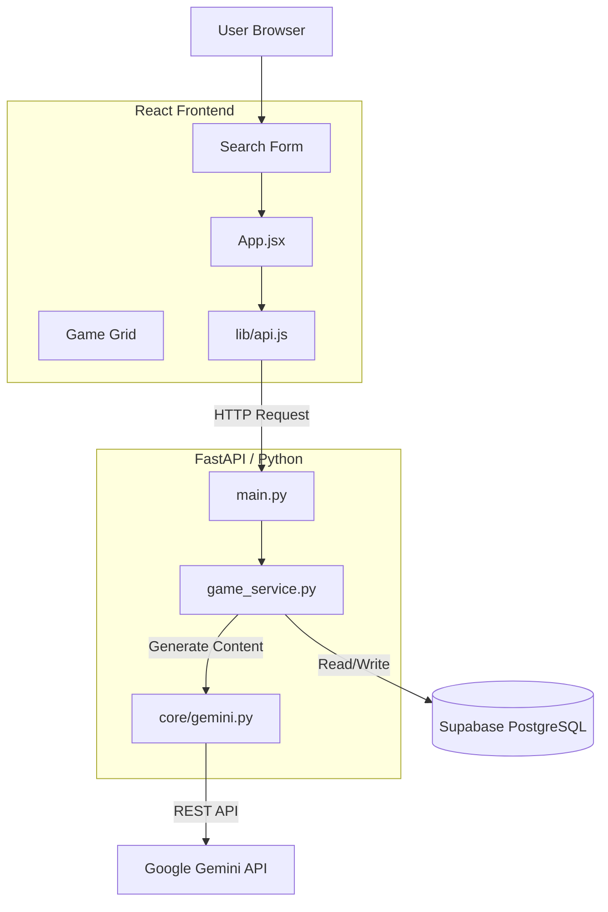

# System Diagrams

## Search & Metadata Generation Flow

This diagram illustrates the flow of a user search request, specifically focusing on the interaction between the Frontend, Backend, and Gemini API, including the "Crash Only" behavior when limits are hit.

```mermaid
sequenceDiagram
    participant User
    participant FE as Frontend (App.jsx)
    participant API as Vercel API (main.py)
    participant DB as Supabase
    participant AI as Gemini API

    User->>FE: Enters specific game name (e.g., "Catan")
    FE->>API: POST /api/search (query="Catan", generate=true)
    activate API
    
    API->>DB: Search existing games
    DB-->>API: Return matches (or empty)
    
    rect rgb(240, 240, 240)
        note right of API: Metadata Generation Phase
        API->>AI: generate_metadata(query)
        activate AI
        
        opt Standard Flow (Success)
            AI-->>API: JSON Response (Title, Summary, Rules)
            deactivate AI
            API->>DB: Upsert Game Data
            DB-->>API: Success
            API-->>FE: Return Game List
            FE-->>User: Display Game Cards
        end
        
        opt Failure: 503 Service Unavailable
            AI--xAPI: 503 Service Unavailable
            deactivate AI
            note right of API: Crash Only: No try/except
            API--xFE: 500 Internal Server Error (Raw Stack Trace)
            FE--xUser: Error Banner (or Hang if missing finally)
        end

         opt Failure: Timeout (Vercel Limit)
            AI-->>API: Processing... (>10s)
            note right of API: Vercel Hard Timeout (10s)
            API--xFE: 504 Gateway Timeout (or 500)
            FE--xUser: Hangs (Loading Spinner forever)
        end
    end
    deactivate API
```

## Component Architecture


