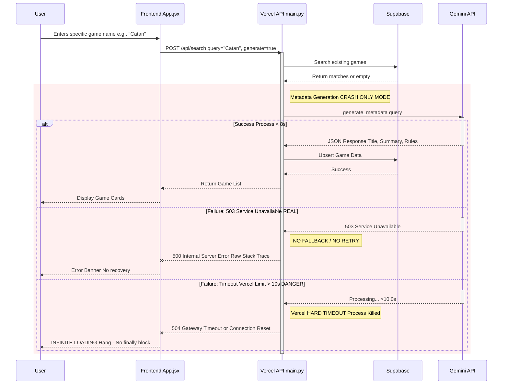
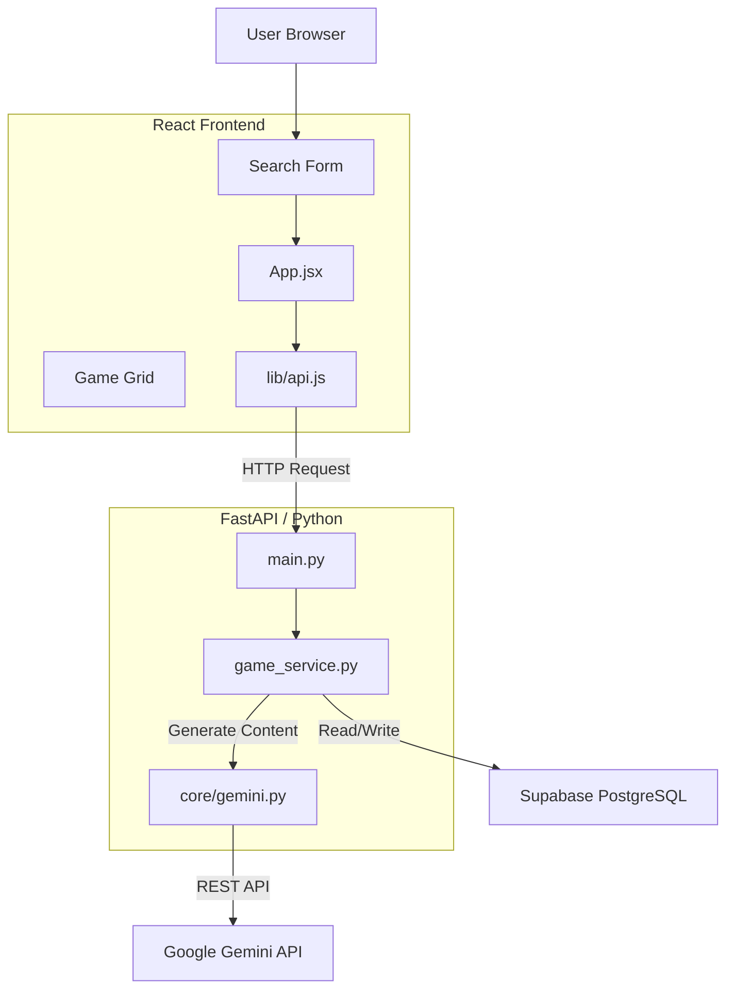

# System Diagrams

## Search & Metadata Generation Flow

This diagram illustrates the flow of a user search request, specifically focusing on the interaction between the Frontend, Backend, and Gemini API, including the "Crash Only" behavior when limits are hit.

## Component Architecture

