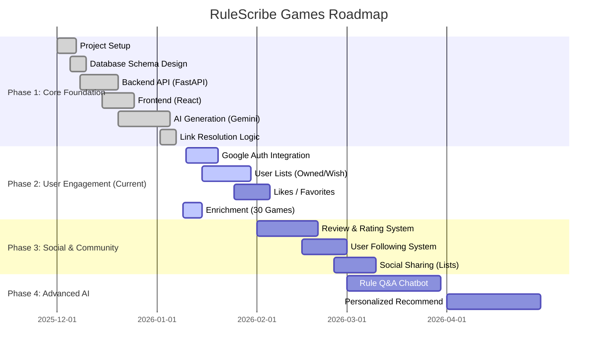

# Project Milestones & Roadmap

This document outlines the development phases, key milestones, and current status of RuleScribe Games.

## detailed Status

### Phase 1: Core Foundation (Completed)
- **Status**: ✅ Completed
- **Deliverables**:
    - High-speed game search and retrieval.
    - AI-powered game data generation (Japanese rules summary).
    - SEO-optimized game pages.
    - Basic "Zero-Fat" architecture.

### Phase 2: User Engagement (In Progress)
- **Focus**: Transforming from a "search tool" to a "platform" where users can manage their board game life.
- **Current Blocker**: Database Schema Drift (Missing `rules_summary` column) preventing mass enrichment of 30 new games.
- **Next Actions**:
    1.  Fix DB Schema (Add `rules_summary`).
    2.  Run `enrich_new_games.py`.
    3.  Complete Google Auth integration.

### Phase 3: Social & Community (Planned)
- **Focus**: Building a community around board games.
- **Key Features**:
    - User reviews and ratings.
    - Social graph (follower/following).
    - Sharing "Best 10" lists.

### Phase 4: Advanced AI (Future)
- **Focus**: Deepening the AI integration beyond static summaries.
- **Key Features**:
    - Interactive Rule Q&A (handling specific edge cases).
    - Personalized recommendations based on user libraries and ratings.
