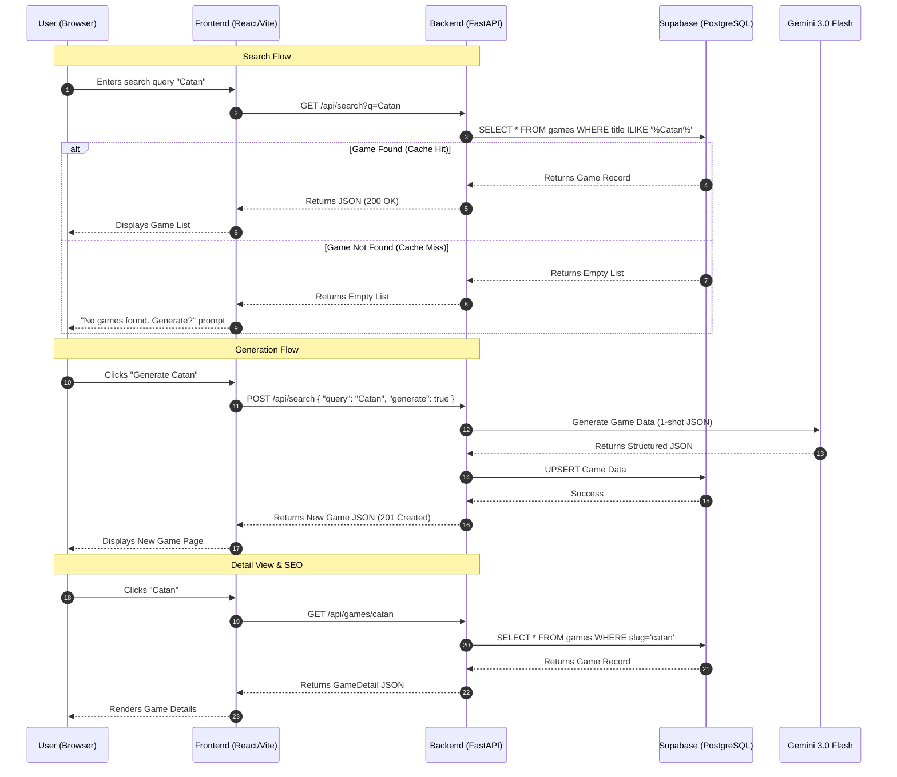

# Game Data Retrieval & Generation Sequence

This document outlines the core sequence for retrieving and generating board game data in RuleScribe Games.

## Overview

The system prioritizes speed and cost-efficiency by checking the local database (Supabase) first. If a game is not found, or if explicitly requested, it triggers an AI generation process using Gemini 3.0 Flash.

## Key Components

1.  **Frontend (React/Vite)**: Handles user interaction and displays data.
2.  **Backend (FastAPI)**: Orchestrates data retrieval and generation.
3.  **Supabase (PostgreSQL)**: Primary data store and cache.
4.  **Gemini 3.0 Flash**: AI engine for generating game data on-demand.

## Scenarios

### 1. Cache Hit (Fast Path)
- **Trigger**: User searches for an existing game.
- **Flow**: API checks DB -> DB returns data -> API returns data to Frontend.
- **Latency**: < 100ms.
- **Cost**: $0.

### 2. Cache Miss & Generation (Slow Path)
- **Trigger**: User requests generation for a missing game.
- **Flow**: API calls Gemini -> Gemini generates JSON -> API saves to DB -> API returns data.
- **Latency**: 3-5 seconds.
- **Cost**: Gemini API Token usage.

