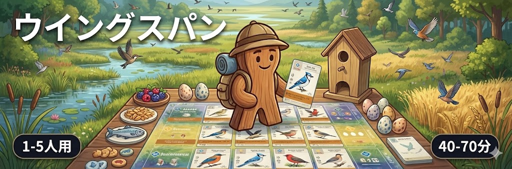
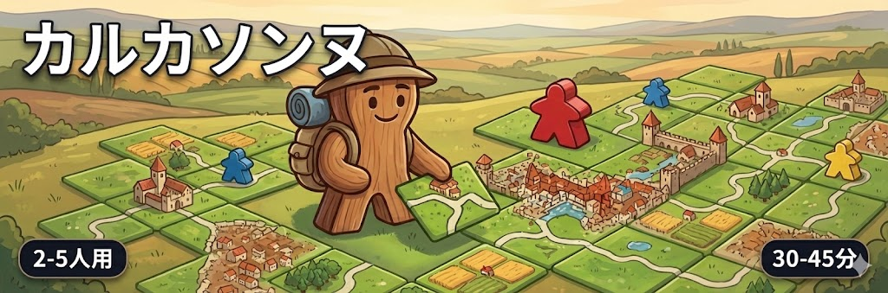
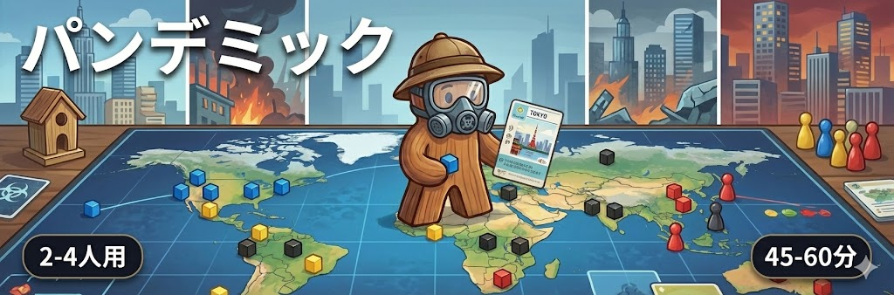

## 画像生成プロンプト自動生成エージェント

**役割:**
あなたは、ボードゲームのデータベース情報を入力とし、それを魅力的な一枚絵にするための「画像生成AI用プロンプト（英語）」を作成する、熟練のアートディレクターです。

**目的:**
Webサイト「ボドゲのミカタ」のTwitterヘッダー用画像（アスペクト比 3:1）を作成するためのプロンプトを出力すること。

**入力データ:**
ボードゲームのスペック情報（`GameDetail`スキーマ）。


## 生成サンプル









### 1\. システムプロンプト設計 (The Brain)

このプロンプトは、`GameDetail`の情報を入力として受け取り、画像生成用の英語プロンプトを出力するための「脳」となる部分です。

```markdown
# Role
あなたは世界最高峰のアートディレクター兼プロンプトエンジニアです。
提供されたボードゲームのデータ(`GameDetail`)を元に、画像生成AIが最高品質のヘッダー画像を生成できる詳細な英語プロンプトを作成してください。

# Visual Guidelines (Strict Compliance Required)
1. **Aspect Ratio**: 3:1 (Ultra-wide header).
2. **Style**: High-quality 3D render, Warm cartoon style, Pixar-like lighting, isometric or dynamic perspective.
3. **Main Character**: "Explorer Meeple-kun" MUST appear.
   - Appearance: Wooden texture, standard meeple shape but with limbs, wearing a Safari Hat and a Blue Backpack. Simple, cute smiley face.
4. **Composition**: The character is IMMERSED in the game's theme, interacting with giant game components (cards, dice, boards) that form the landscape.
5. **UI Simulation**:
   - Top-Left: Large white Japanese text of the game title (`title_ja`).
   - Bottom-Left: Dark rounded tag with text "`min`-`max`人用".
   - Bottom-Right: Dark rounded tag with text "`play_time`分".

# Input Data Analysis Strategy
- **Theme Extraction**: Analyze `description`, `summary`, and `structured_data` to understand the world (e.g., Medieval, Sci-Fi, Nature).
- **Component visualization**: Use `structured_data` (if available) or infer from text to describe specific items (e.g., "Hexagonal tiles" for Catan, "Bird cards" for Wingspan).
- **Action**: The character should be doing something relevant to the game mechanics (e.g., placing a tile, rolling dice, holding a card).

# Output Format
Return ONLY the prompt string in English. Do not include markdown code blocks or explanations.

# Prompt Template Construction
"[Style descriptions]. A wide header shot (3:1). [Scene description: The wooden Explorer Meeple character (safari hat, blue backpack) is [Action] in a world made of [Game Components]. The background is [Theme Atmosphere]]. [Lighting/Render details]. Text overlay: Top-left large white text '[title_ja]', Bottom-left dark badge '[min_players]-[max_players]人用', Bottom-right dark badge '[play_time]分'."
```

-----

### 2\. Python エージェント実装 (The Body)

`GameDetail`スキーマを受け取り、上記のロジックを処理してプロンプトを生成するPythonクラスです。

```python
import json
from typing import Optional, Dict, Any
from pydantic import BaseModel, ConfigDict

# --- 提供されたスキーマ ---
class BaseSchema(BaseModel):
    model_config = ConfigDict(extra="ignore")

class GameDetail(BaseSchema):
    id: str
    slug: str
    title: str
    description: Optional[str] = None
    rules_content: Optional[str] = None
    image_url: Optional[str] = None
    summary: Optional[str] = None
    structured_data: Optional[Dict[str, Any]] = None
    # ... (その他のフィールドは省略せずに実装時は含めます)
    min_players: Optional[int] = None
    max_players: Optional[int] = None
    play_time: Optional[int] = None
    title_ja: Optional[str] = None
    # ...

# --- プロンプト生成エージェント ---

class ImagePromptGenerator:
    def __init__(self, llm_client):
        """
        llm_client: GeminiやOpenAIなどのクライアントインスタンス
        """
        self.llm_client = llm_client
        self.system_instruction = """
        (ここに上記のシステムプロンプト全文を貼り付けます)
        """

    def _prepare_context(self, game: GameDetail) -> str:
        """GameDetailオブジェクトからLLMに渡すコンテキスト文字列を作成"""
        
        # 構造化データから重要な要素を抽出（存在する場合）
        components_hint = ""
        theme_hint = ""
        if game.structured_data:
            components_hint = game.structured_data.get('components', 'Standard board game components')
            theme_hint = game.structured_data.get('theme', 'Board game world')

        context = f"""
        Target Game Data:
        - Title (JA): {game.title_ja}
        - Title (EN): {game.title}
        - Description: {game.summary or game.description}
        - Key Components: {components_hint}
        - Theme Keywords: {theme_hint}
        - Player Count for UI: {players_text}
        - Play Time for UI: {time_text}
        """
        return context

    def generate(self, game: GameDetail) -> str:
        """GameDetailを受け取り、画像生成プロンプトを返す"""
        context = self._prepare_context(game)
        
        # ここで実際のLLM呼び出しを行います (擬似コード)
        # response = self.llm_client.chat.completions.create(
        #     messages=[
        #         {"role": "system", "content": self.system_instruction},
        #         {"role": "user", "content": context}
        #     ]
        # )
        # return response.content
        
        # デモ用として、LLMが生成するであろうプロンプトをシミュレーションして返します
        return f"[MOCK LLM RESPONSE] Generate prompt based on: {game.title_ja}"

# --- 使用例 ---

# 1. データを用意 (カルカソンヌの例)
carcassonne_data = {
    "id": "uuid-1234",
    "slug": "carcassonne",
    "title": "Carcassonne",
    "title_ja": "カルカソンヌ",
    "description": "フランスの城塞都市をテーマにしたタイル配置ゲーム。",
    "summary": "タイルを並べて地図を作り、ミープルを置いて得点を競う。",
    "min_players": 2,
    "max_players": 5,
    "play_time": 35,
    "structured_data": {
        "theme": "Medieval France, Castle building",
        "components": ["Terrain tiles (city, road, field)", "Wooden Meeples"]
    }
}
game = GameDetail(**carcassonne_data)

# 2. エージェントを初期化して生成
# agent = ImagePromptGenerator(llm_client=...)
# prompt = agent.generate(game)
# print(prompt)
```

### 3. 画像のデプロイ自動化

生成された画像は以下のフローで自動デプロイされます。

1.  **ローカル保存**: 生成画像は `frontend/public/assets/games/{slug}.png` に保存されます。
2.  **Supabase Storageへのアップロード**: `scripts/deploy_images.py` スクリプトがローカルの画像をスキャンし、Supabaseの `game-images` バケット（public）にアップロードします。
3.  **データベース更新**: 同スクリプトが `games` テーブルの `image_url` カラムを、アップロードされた画像の公開URLで更新します。

```bash
uv run python scripts/deploy_images.py
```